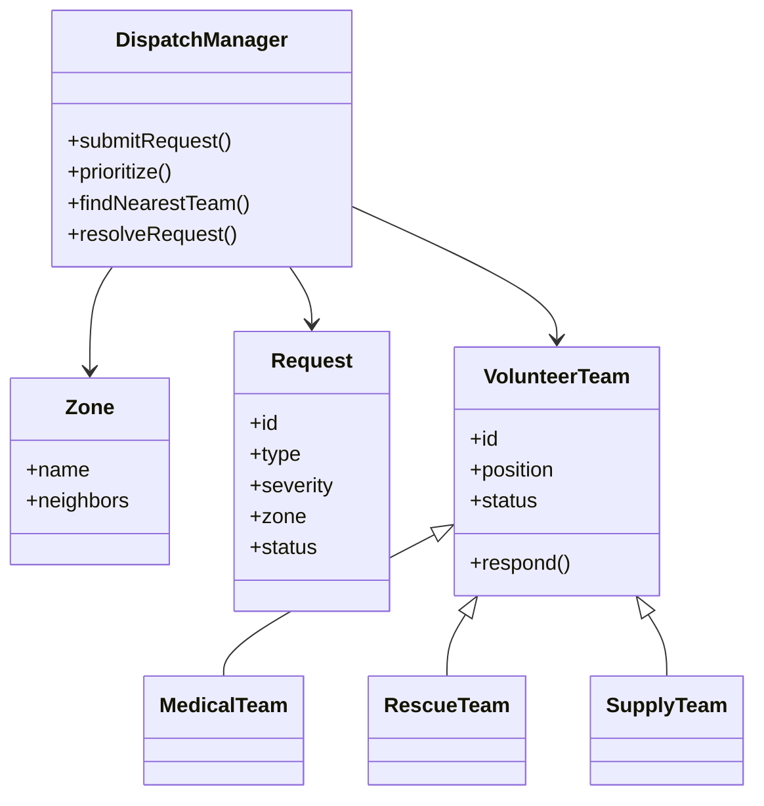

# D.R.O.N.E.
### Disaster Relief Optimized Network for Emergencies

**PBL project · Interactive browser prototype**  
**Team:** Resqnet · **Team number:** T160

D.R.O.N.E. is a classroom prototype for coordinating disaster-relief requests. It demonstrates how incoming reports can be classified by urgency, matched with a suitable medical, rescue, or supply team, and routed across a network of affected zones. Requests remain in a waiting queue when no suitable team is available.

The accompanying project proposal describes a layered C/C++ dispatch engine and a command-line demonstration. This deliverable adds an interactive browser presentation for the same workflow. Its JavaScript simulator demonstrates the dispatch logic locally; it is not connected to a C/C++ service or a live emergency network.

## Project team

- Lakshita Gusain — Team lead
- Prerna Shukla
- Karan Singh Kiroula
- Manishka Bisht

## Current project status

The project is selected and its interactive browser prototype is prepared for the Phase 2 presentation. The prototype is written in HTML, CSS, and JavaScript so it can run directly from `index.html`. C/C++, data structures, and OOP remain part of the team's broader project plan; the current browser simulator does not connect to a C/C++ backend.

## Problem statement

During floods, earthquakes, and other disasters, many people may request help at the same time. Relief coordinators need to identify the most urgent needs, find a nearby team with the right specialty, and keep track of requests that cannot yet be served. Calls and paper records can make it difficult to maintain a clear, prioritized picture of the response.

## Objectives

1. Capture and classify emergency requests by type, affected zone, and urgency.
2. Process critical requests before lower-priority requests, with earlier requests first when urgency is equal.
3. Match Medical, Rescue, and Supply requests to teams with the same specialty.
4. Select the nearest suitable team through a shortest-path calculation over the zone network.
5. Keep requests waiting when no suitable team is free and retry them when a team returns to service.
6. Show requests, teams, zones, routes, and dispatch activity in an understandable interactive interface.
7. Demonstrate core data-structure and object-oriented design ideas in a small, repeatable scenario.

## How to run

1. Open `index.html` in a current desktop or mobile browser. No installation, build step, or internet connection is required.
2. Use **New request** to submit a Medical, Rescue, or Supply report.
3. Review the dispatch result on the Command center or Requests page. A suitable available team is assigned automatically; otherwise the report enters the priority queue.
4. Resolve a dispatched report from the Requests page to release its team. If that team type has a waiting request, the next request is dispatched automatically.
5. Select a zone on the response map to preview a route and use **Ask dispatch** for questions about the current simulation.
6. Choose **Reset demo data** in the sidebar to restore the starting scenario.

The browser stores demo changes in local storage. Reset the demo to return to the initial set of requests and teams. Submitted reports are classroom data; do not enter real personal or emergency information.

## Prototype features

- **Request intake:** type, urgency, zone, reporter label, and description.
- **Urgency queue:** Critical, High, Medium, then Low; first received breaks ties.
- **Specialty matching:** each team serves requests of one type.
- **Route selection:** Dijkstra's shortest-path algorithm uses the weighted links in the simulated zone graph.
- **Waiting queue:** unserviceable reports remain visible and are retried after a team becomes available.
- **Team lifecycle:** mark an idle unit available or out of service; resolve an assigned report to return its team to service.
- **Dispatch log:** recent assignment, resolution, and status changes.
- **Local query assistant:** answers data-based questions about requests, teams, zones, priorities, and routes. It uses preset local rules and does not call an AI service.
- **Browser persistence:** requests and team changes survive a page reload on the same browser profile.
- **Responsive layout:** command center, request list, team roster, and zone network adapt to narrower screens.

## Dispatch logic

The simulator keeps pending reports in a **binary min-heap**. Its comparator promotes higher urgency and then an earlier received time. When processing the queue, it checks teams of the requested type, filters for available units, computes shortest distances from those units' current zones, and selects the closest reachable team. A successful match updates the request and team; when no match exists, the report remains queued.

The zone network is an undirected weighted graph. Dijkstra's algorithm stores tentative distances and predecessor links, then reconstructs the route to the request zone. The map's links and distances are illustrative scenario data, not live road information.

### Example flow

```text
New report
    ↓
Priority queue (urgency, then received time)
    ↓
Find available team with matching specialty
    ├── none available → keep request waiting
    └── team available → Dijkstra route → assign team
                                      ↓
                              Resolve the report
                                      ↓
                         Release team and retry queue
```

## Architecture and OOP mapping

The browser prototype puts the interface, scenario state, and algorithms in a small set of static files. The proposal's C/C++ design can be represented by the following conceptual model:



In an expanded C/C++ implementation, the `VolunteerTeam` base class can define a virtual response method, with the medical, rescue, and supply subclasses providing specialty-specific behavior. A C data-structure module could expose its priority queue and graph operations through `extern "C"` wrappers. JSON or CSV files could supply the initial zone, team, and request data and retain dispatch history.

## Project structure

```text
drone-disaster-management/
├── index.html   # Interface and dialog markup
├── styles.css   # Responsive visual design
├── app.js       # Scenario data, queue, routing, and interactions
├── README.md    # PBL overview and operating notes
├── PHASE2_CONTRIBUTIONS.md # Four-person Phase 2 work split
└── .gitignore   # Keeps local editor and OS files out of Git
```

## Assumptions and limits

- Zones, connecting distances, teams, and starting incidents are predefined demonstration data.
- One team handles one open request at a time. A team can take another request after its current report is resolved.
- Teams are matched by specialty; this prototype does not model equipment, team size, patient capacity, or travel times.
- Route distances are simplified and do not use GPS, live road closures, traffic, weather, or real hazard feeds.
- Data is kept only in the current browser profile. There is no server, shared team view, login, role permissions, or remote synchronization.
- The query assistant uses local keyword rules and current scenario data. It does not understand arbitrary natural language and is not an emergency operator.
- This is a project demonstration, not an operational disaster-management system. For a real emergency, contact the appropriate local emergency service.

## Suggested classroom demonstration

1. Point out that the two starting rescue reports are waiting because both rescue teams are occupied.
2. Submit a Critical Supply request in a zone and observe the nearest available Supply unit and route result.
3. Submit a Critical Rescue request and observe it remain queued despite available teams of other specialties.
4. Resolve an in-field Rescue report. The released team should be matched to the highest-priority waiting Rescue request.
5. Ask the local assistant which request is next and how route selection works.

For the agreed four-person work split, ownership boundaries, and individual GitHub workflow, see [PHASE2_CONTRIBUTIONS.md](PHASE2_CONTRIBUTIONS.md).

## Source proposal

This prototype uses the project title, team identity, problem framing, goals, and dispatch approach in the supplied D.R.O.N.E. proposal. The interface extends its planned presentation layer with a browser-based demonstrator while preserving its stated assumptions about predefined zones, teams, and distances.
